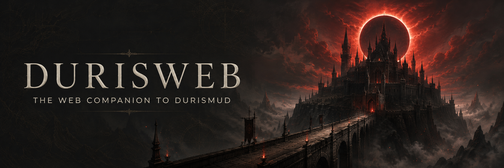
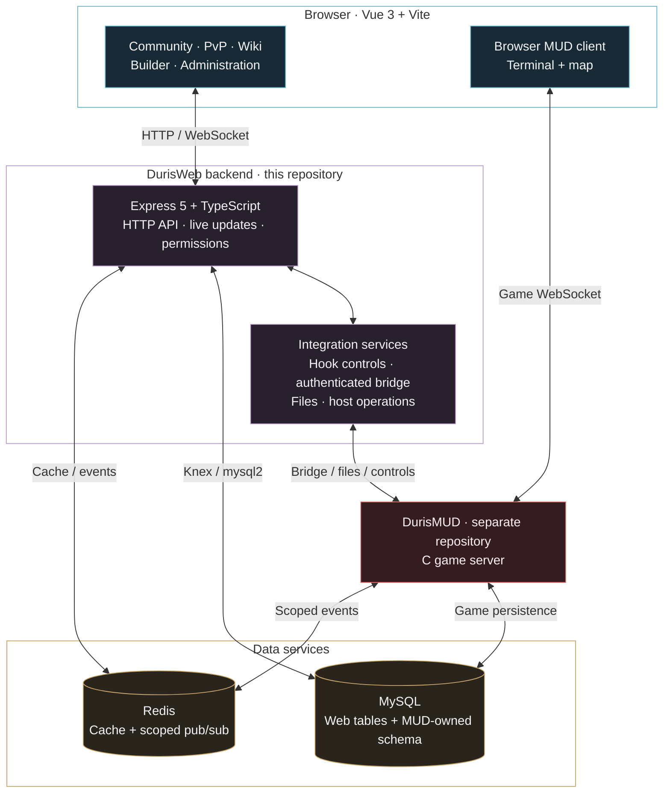

<p align="center">
  <a href="https://github.com/Community-Duris/DurisWebApp/actions/workflows/quality.yml"></a>
  <a href="docs/onboarding.md"></a>
  <a href="backend/package.json"></a>
  <a href="docs/CONVENTIONS.md"></a>
  <br>
  <a href="frontend/README_frontend.md"></a>
  <a href="frontend/package.json"></a>
  <a href="frontend/package.json"></a>
  <a href="backend/README_backend.md"></a>
  <a href="docs/ARCHITECTURE.md"></a>
  <a href="docs/ARCHITECTURE.md"></a>
</p>

# DurisWeb

**The community, knowledge, and command center for DurisMUD.**

DurisWeb brings a text-based PvP world to the web: follow battles, explore the
world wiki, join the forums, play in your browser, and build or administer the
game through permission-controlled tools. It pairs a Vue frontend with an
Express API and integrates with the separately maintained DurisMUD C server.

<p align="center">
  <a href="#what-you-can-do">Explore features</a> ·
  <a href="#how-it-fits-together">Architecture</a> ·
  <a href="#get-started">Get started</a> ·
  <a href="#development">Development</a> ·
  <a href="#documentation">Documentation</a> ·
  <a href="https://github.com/Community-Duris/DurisWebApp/issues">Issues</a>
</p>

## What you can do

| Area | In the application |
|---|---|
| **Play & explore** | Browser MUD client, map views, and a wiki of zones, objects, and mobs, alongside guides and help content. |
| **Follow the fight** | PvP battle records, battle details, frag leaderboards, and faction activity statistics. |
| **Stay connected** | Forums, search, notifications, news, and account and guild profiles. |
| **Watch the market** | Current auctions, item details, and auction history. Direct web bid/buy-now mutations are gated off by default. |
| **Build the world** | Builder dashboard, zone editor, and builder settings for authorized users. |
| **Run the community** | Moderation, permissions, hook controls, MUD operations, server health, logs, and backup tooling. |
| **Handle downtime** | Website availability notices and an optional, separately deployed Cloudflare Worker for maintenance and origin outages. |

Feature availability depends on permissions, configuration, MUD compatibility,
and provisioned data. Wiki publication and forum bootstrap are explicit setup
steps; a healthy API alone does not prove every feature is ready.

## How it fits together

Two independent TypeScript packages form the website. Express serves the
website APIs and live updates, coordinates integrations, and accesses MySQL
through Knex/mysql2. The browser game client also opens its own connection to
the configured MUD endpoint.



The diagram shows the shared-database topology. Configuration also supports a
separate MUD database; MUD-owned tables retain the same ownership boundary.
Browsers never access MySQL or Redis directly. Remote privileged bridge
connections require certificate-validated WSS, and MUD-backed hooks depend on
both website and MUD controls. Host operations require the corresponding
permissions and host configuration.

See the [architecture and data contracts](docs/ARCHITECTURE.md) and
[hook registry guide](backend/src/hooks/README_hooks.md) for the full boundaries.

## Get started

Use **Node.js 22.12 or newer in the 22.x line**, **pnpm 10.15.1**, and **Docker
with Docker Compose**. Game-data features also need a local DurisMUD checkout
and an operator-approved database baseline.

> [!IMPORTANT]
> Compose starts database and cache infrastructure. It does **not** create a
> complete application schema. The historical Knex migration chain cannot
> bootstrap an empty MUD-compatible database. Follow the
> [onboarding guide](docs/onboarding.md) with an approved schema baseline and
> isolated development data before starting the application.

**1. Clone and install both packages.**

```bash
git clone https://github.com/Community-Duris/DurisWebApp.git
cd DurisWebApp
corepack prepare pnpm@10.15.1 --activate
pnpm --dir backend install --frozen-lockfile
pnpm --dir frontend install --frozen-lockfile
```

**2. Create and configure the three local environment files.**

```bash
cp .env.example .env
cp backend/.env.example backend/.env
cp frontend/.env.example frontend/.env
```

Replace every placeholder, align database/cache settings, generate independent
secrets, and select the feature flags deliberately. Set `MUD_DIR` to the
separate MUD checkout. All `VITE_*` values are public browser configuration;
keep credentials on the backend. Follow
[configuration ownership](docs/environments.md) for the required values.

**3. Validate configuration, then start.**

```bash
pnpm --dir backend config:check
pnpm --dir frontend config:check
./scripts/dev.sh
```

The script starts MySQL, Redis, the backend, and the frontend, then prints the
configured site and backend health URLs. `Ctrl-C` stops the application
processes. Stop the local dependency containers separately when finished:

```bash
docker compose --env-file .env -f podman-compose.yml down
```

## Development

This is a logical monorepo with **independent pnpm projects**, each with its own
manifest and lockfile. There is no root package manifest or pnpm workspace.
Run package commands from the repository root with `pnpm --dir`.

| Task | Backend | Frontend |
|---|---|---|
| Development server | `pnpm --dir backend dev` | `pnpm --dir frontend dev` |
| Configuration check | `pnpm --dir backend config:check` | `pnpm --dir frontend config:check` |
| Formatting | `pnpm --dir backend format:check` | `pnpm --dir frontend format:check` |
| Lint | `pnpm --dir backend lint` | `pnpm --dir frontend lint` |
| Type check | `pnpm --dir backend type-check` | `pnpm --dir frontend type-check` |
| Tests | `pnpm --dir backend test --runInBand` | `pnpm --dir frontend test:unit --run` |
| Production build | `pnpm --dir backend build` | `pnpm --dir frontend build` |

Database-backed tests require isolated test dependencies; see
[development](docs/development.md). Changes involving MUD-owned database writes
also require `pnpm --dir backend verify:mud-writes` with the matching MUD schema
manifest available. The [Code Quality workflow](.github/workflows/quality.yml)
runs formatting, lint, type checks, configuration-ownership checks, and MUD-write
verification. Test suites and production builds are separate local release
checks; the workflow badge is not a deployment-health indicator.

```text
backend/              Express API, domain services, hooks, migrations
frontend/             Vue application, browser client, builder, admin UI
docs/                 Setup, architecture, contracts, and runbooks
deploy/               Host templates, recovery scripts, maintenance worker
scripts/              Development entry point and repository checks
.github/workflows/    GitHub Actions quality checks
podman-compose.yml    Configurable local database and cache services
```

## Operations & readiness

Deployment uses operator-supplied configuration rendered into systemd, Redis,
and ingress templates. The repository does not define a universal production
hostname, port, or installation path. Follow the
[deployment guide](docs/deployment.md) for builds, preflight checks, wiki
publication, database rehearsal, and recovery. Website and MUD releases must
record and verify their exact commits independently.

- **Health:** backend `/health` checks MySQL and Redis. The frontend health
  artifact is static; neither check validates every feature or imported dataset.
- **Mutation boundaries:** direct auction bid/buy-now writes, item deletion,
  player wipe, and legacy database restore remain closed by default. Read the
  [mutation contracts](docs/ARCHITECTURE.md#mutation-authority-and-default-closed-gates)
  before operating these features.
- **Security work remains:** the [security record](docs/SECURITY-COMPLIANCE.md)
  documents open dependency, refresh-token, session-timezone, and privacy-lifecycle
  concerns. Consult it alongside release-specific validation.
- **Downtime handling:** [maintenance and outage notices](deploy/maintenance/README.md)
  explain the optional edge deployment and operator controls.

## Documentation

| Start here | Go deeper |
|---|---|
| [Onboarding](docs/onboarding.md) | [Architecture & database contracts](docs/ARCHITECTURE.md) |
| [Development commands](docs/development.md) | [HTTP API](docs/api/README_api.md) |
| [Configuration & environments](docs/environments.md) | [Hook registry & integration](backend/src/hooks/README_hooks.md) |
| [Backend guide](backend/README_backend.md) | [Deployment & recovery](docs/deployment.md) |
| [Frontend guide](frontend/README_frontend.md) | [Incident response](docs/runbooks/incident-response.md) |
| [Contributing](CONTRIBUTING.md) | [Security & compliance record](docs/SECURITY-COMPLIANCE.md) |
| [Repository conventions](docs/CONVENTIONS.md) | [Project considerations](docs/CONSIDERATIONS.md) |

## Contribute

Use the [issue tracker](https://github.com/Community-Duris/DurisWebApp/issues)
for bugs and focused proposals. Start from the current `master` branch, keep
changes scoped, and follow the [contribution guide](CONTRIBUTING.md) and relevant
package checks. Work on the DurisMUD server belongs in its separate repository.
